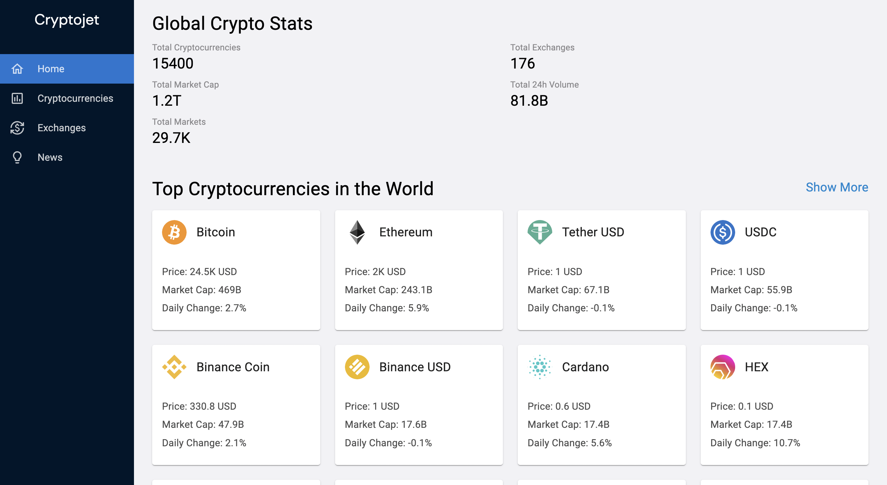

# Cryptojet

## Introduction

This is a code repository of a Cryptocurrencies Watcher.

Project uses: Redux Toolkit, MUI Styles, React ChartJs, chart.js,...

Application has all news, prices of top 100 cryptocurrencies in the world.

Data was from: [https://rapidapi.com/Coinranking/api/coinranking1](https://rapidapi.com/Coinranking/api/coinranking1)

Live web link: [https://cryptojet.netlify.app/](https://cryptojet.netlify.app/)
